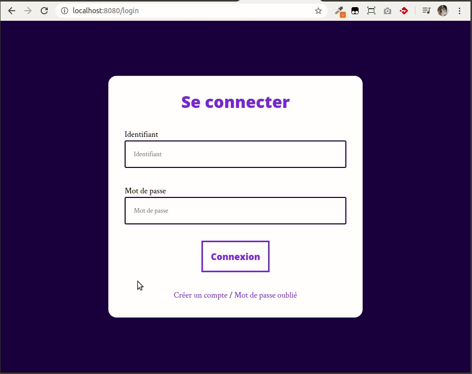

# Login

## Instructions

L'objectif est de créer une interface utilisateur agréable pour naviguer entre 3 vues : un formulaire de connexion, un formulaire d'inscription et un formulaire de mot de passe oublié.

Une image vaut mieux que 1000 mots :

## Etapes

1. Créer les composants
2. Utiliser React Router pour synchroniser la navigation entre les vues avec la barre d'adresse du navigateur
3. Utiliser Styled-Components pour styler nos composants

## Charte

Cette fois-ci plus encore que d'habitude, on se donne pour objectif de faire une interface assez jolie… alors on sort ce qu'il faut : polices, couleurs, sens du détails !

### Google Fonts

* Titres et boutons : Open Sans / _extra bold_
* Textes : Crimson Text / _regular_

### Couleurs

* Couleur principale : #686de0
* Couleur complémentaire : #130f40

---

  

    Bonus
  

- Ajouter une redirection de toutes les urls autres que celles associées à nos 3 vues. La redirection pointe sur la vue de login

